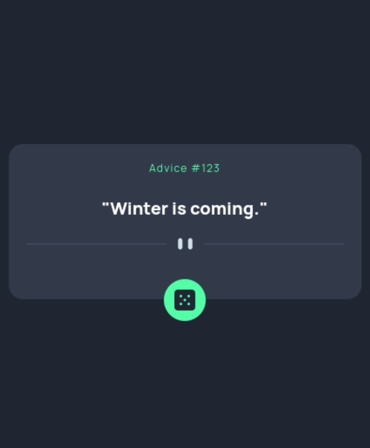

# Frontend Mentor - Advice generator app solution

This is a solution to the [Advice generator app challenge on Frontend Mentor](https://www.frontendmentor.io/challenges/advice-generator-app-QdUG-13db). Frontend Mentor challenges help you improve your coding skills by building realistic projects.

## Table of contents

-   [Overview](#overview)
    -   [The challenge](#the-challenge)
    -   [Screenshot](#screenshot)
    -   [Links](#links)
-   [My process](#my-process)
    -   [Built with](#built-with)
-   [Author](#author)

## Overview

### The challenge

Users should be able to:

-   View the optimal layout for the app depending on their device's screen size
-   See hover states for all interactive elements on the page
-   Generate a new piece of advice by clicking the dice icon

### Screenshot

### Links

-   Solution URL: [Github Advice Generator](https://github.com/jeremy93-2008/advice-generator)
-   Live Site URL: [Advice Generator Live Site](https://jeremy93-2008.github.io/advice-generator/)

## My process

### Built with

-   Flexbox
-   Mobile-first workflow
-   [React](https://reactjs.org/) - JS library
-   [TailwindCSS](https://tailwindcss.com/) - For styles

## Author

-   Website - [Jeremy Auvray](https://github.com/jeremy93-2008)
-   Frontend Mentor - [@jeremy93-2008](https://www.frontendmentor.io/profile/jeremy93-2008)
